# Introdução

## Sobre o tutorial

Geoprocessamento + Linguagens da programação

Este tutorial se originou a partir da confecção de um relatório de atividades da autora, Camila Totti, para o projeto do qual é integrante - "[Processamento e Análise de Dados Ambientais com R](https://sites.google.com/uenf.br/pexcca-lametuenf/extens%C3%A3o/processamento-e-an%C3%A1lise-de-dados-ambientais-com-r?authuser=0)" do Laboratório de Metereologia da UENF. Na busca por métodos de confeccionar mapas de alta qualidade no R, ela encontrou um [tutorial](https://www.youtube.com/watch?v=zgFXVhmKNbU&t=3148s) da autoria de [Spencer Schien](https://github.com/Pecners) ensinando a criar um mapa 3D no R utilizando o pacote Rayshader.

Porque criar um tutorial baseado em um tutorial? A decisão foi motivada por dois fatores principais. Primeiro, o original é em inglês e a divulgação na língua portuguesa é mais um facilitador para o acesso a informação. Segundo, foram alguns dias e muita pesquisa de *bug corrections* e erros inesperados, alguns sem precedentes que foram "resolvidos na marra", uma vez que não haviam registros anteriores ou haviam registros mas ainda lhes faltavam solução. Portanto, esse tutorial também busca polpar aqueles que têm interesse em trilhar o mesmo caminho sem ter que lidar com os mesmos obstáculos.

A seguir o leitor terá acesso, portanto, a um tutorial detalhado de como gerar um mapa 3D de alta qualidade utilizando o pacote [rayshader](https://www.rayshader.com/) e dados de densidade populacional do site da Kontur, a partir da linguagem de programação R. Apesar do foco ser a geração do mapa 3D com o pacote `rayshader`, este tutorial abrange todas as etapas da produção do mapa, desde a obtenção dos dados ao processamento deles, até a parte de renderização do mapa 3D em si.

## Sobre o pacote Rayshader:

Rayshader é um pacote de código aberto voltado para a produção visual 2D e 3D de dados no R. O pacote utiliza dados de elevação em uma matriz base R e uma combinação de *raytracing*, algoritmos de sombreamento e sobreposições para gerar mapas. Para saber mais sobre o pacote é possível acessar seu [site oficial](https://www.rayshader.com/).

## Sobre os dados utilizados:

Para gerar o mapa 3D nós utilizamos os dados de densidade populacional do site da [Kontur](https://www.kontur.io/). A Kontur é uma fornecedora de soluções de gerenciamento de risco em tempo real e dados geoespaciais para organizações humanitárias, privadas e governamentais; que utiliza uma combinação de processamento de dados e tecnologias de mapeamento inovadoras para fornecer insights visuais baseados em localização. Para saber mais sobre a Kontur clique [aqui](https://www.kontur.io/about/).

## Uma observação sobre o uso alternado dos pipes `|>` e `%>%` neste tutorial:

Ao longo do tutorial será possível observar o uso de ambos o pipe nativo do R `|>` quanto do pipe oriundo do pacote `magrittr`, o `%>%`. Apesar de não haver grandes diferenças entre os dois pipes, o `%>%` do pacote magrittr é considerado melhor por apresentar maior versatilidade e aplicações do que o pipe nativo `|>`. Portanto, caso o leitor não queira utilizar ambos como feito abaixo, recomenda-se o uso único do pipe `%>%`. Além disso, na documentação do pacote `rayshader` está registrado que suas funções possuem compatibilidade com o pipe `%>%` do pacote magrittr..

\_\_\_\_\_\_\_\_\_\_\_\_\_\_\_\_\_\_\_\_\_\_\_\_\_\_\_\_\_\_\_\_\_\_\_\_\_\_\_\_\_\_\_\_\_\_\_\_\_\_\_\_\_\_\_\_\_\_\_

# Download, Importação e verificações iniciais

## Realizando o download dos dados

Os dados utilizados neste tutorial são oriundos do site [kontur](https://www.kontur.io/). Nós utilizamos os [dados de densidade populacional filtrados para o Brasil](https://data.humdata.org/dataset/kontur-population-brazil), uma vez que no site é possível obter estes dados para países do mundo inteiro no site.

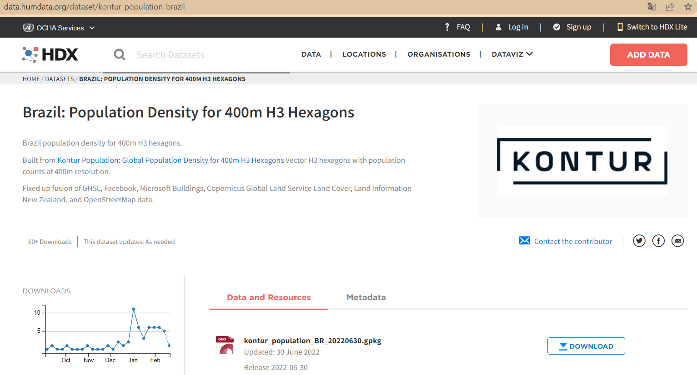

**Nota:** os dados, mesmo filtrados para o Brasil, são pesados (106 MB) então o download pode levar algum tempo.

Uma vez concluído o download, você deve salvar o arquivo GeoPackage (.gpkg) no diretório do seu projeto. Neste caso, criamos uma pasta intitulada "data" para armazená-lo.

## Importando os dados espaciais

Para ler o arquivo no formato GeoPackage, vamos informar o caminho e nome do arquivo para a função `st_read()` da biblioteca `sf`.

Atribuímos os dados do GeoPackage à variável `dados`.

**Atenção:** Esta etapa também pode levar algum tempo. A não ser que você esteja trabalhando com um país pequeno, não é recomendado tentar plotar imediatamente os dados, pois devido ao tamanho do dataset as chances de travar a sua sessão R são grandes.

## Importando dados dos estados do país

Como o nosso dataset do Kontur possui os dados apenas para o país, precisamos importar outro dataset com as subdivisões estatais para o país que estamos trabalhando. Neste caso, como estamos trabalhando com o Brasil, realizamos o download diretamente do site do [IBGE](https://www.ibge.gov.br/geociencias/organizacao-do-territorio/malhas-territoriais/15774-malhas.html?=&t=acesso-ao-produto), que oferece um arquivo shapefile com os limites dos estados brasileiros.

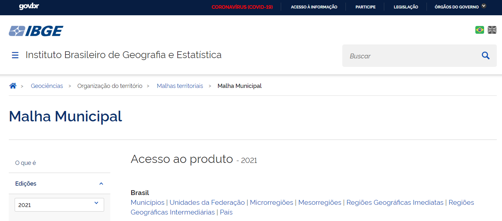{width="674"}

No site clicamos em "Municípios" para baixar os limites territoriais do Brasil com as divisões municipais incluídas. Salvamos o arquivo na nossa pasta "dados". Note que o shapefile é composto por um conjunto de arquivos relacionados, portanto, é importante salvar todos juntos no mesmo diretório. Na importação selecionamos apenas o em formato `.shp`, mas os outros são "puxados" automaticamente.

Utilizamos novamente a função `st_read()` para importar agora o arquivo shapefile baixado do site do IBGE. Atribuímos os dados à veriável `estados_br`.

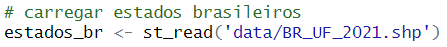{width="371"}

## Filtrando dados para o estado do Rio de Janeiro

Para selecionar os dados referentes apenas ao estado do Rio de Janeiro, primeiro precisamos saber o nome da coluna em que ele está armazenado e como está nomeado no nosso dataframe `estados_br`. Para isso vamos importar o `tidyverse` e utilizar a função `glimpse(estados_br)`.

Após verificar que `RJ` está na coluna `SIGLA` de `estados_br`, utilizamos a função `filter(SIGLA == 'RJ')` para filtrar os dados da Florida e armazenamos na variável `rio`.

Também aproveitamos para igualar o sistema de coordenadas de `rio` com o do geodataframe `data`.

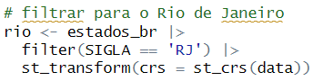{width="334"}

## Exportando dados de `rio`

Nós vamos salvar os dados filtrados de `rio` como um arquivo Shapefile no diretório para que na próxima sessão não seja necessário filtrar e reprojetar os dados novamente.

Para exportar os dados de `rio` utilizamos a função `st_write()` e informamos primeiro o nome do dataframe que queremos exportar (`rio`) e, em seguida, o nome e o formato que os dados vão adquirir ao ser exportados (fica a critério, aqui nomeamos como `RJ_kontur_epsg3857.shp`).

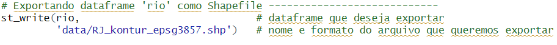

## Verificando dados importados e filtrados

Para ter uma visão inicial dos dados filtrados do `rio`, podemos plotar eles com `ggplot()` + `geom_sf()`.

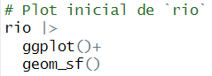{width="212"}

Ao plotar verificamos que temos o contorno do estado da Flórida corretamente plotado no gráfico.

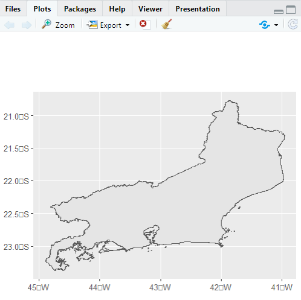{width="376" height="375"}

# Juntando dados de `data` com `rio`

Para juntar as tabelas, o **Sistema de Referência de Coordenadas** de ambas devem ser iguais. Portanto o primeiro passo a se fazer é verificar se o **SRC** é igual e, se não for, precisamos corrigir isso.

Utilizamos a função `st_crs()` para verificar se são iguais da seguinte maneira: `st_crs(rio) == st_crs(data)` se TRUE são iguais, se FALSE são diferentes.

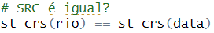{width="243" height="39"}

Se o teste retornar `FALSE`, podemos aplicar a função `st_transform(st_crs(data))` para `rio` para tornar seu SRC igual ao do dataframe `data`.

> isso pode ser feito incluindo uma linha de código na sequência pipe da etapa "**Filtrando dados para o estado do Rio de Janeiro**"

Se o teste retornar `TRUE` podemos juntar as tabelas. Para isso utilizamos a função `st_interseccion()` onde informamos onde queremos aplicar a intersecção (`data`) e por qual dado (`rio`). Atribuímos o resultado à variável `estado_rio`.

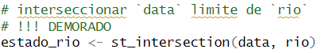{width="356"}

**NOTA:** Esta etapa é bem demorada, levou mais de 50 minutos para completar.

**DICA:**

-   Podemos salvar o novo arquivo `estado_rio` no computador, para não ter que repetir o processo de importação e *merge* ao trabalhar novamente com os mesmos dados..

-   Para exportar o arquivo `estado_rio`, utilizamos a função `st_write()` onde o primeiro argumento é o dataframe a ser exportado, e o segundo argumento é o caminho, nome e formato do arquivo numa string.

> 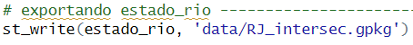{width="398"}

## Visualizando o resultado da intersecção

Podemos visualizar rapidamente o resultado da intersecção com `ggplot()` para verificar se o processo ocorreu de forma correta e que os dados estão conservados no geodataframe.

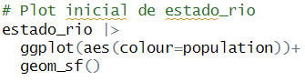

Aqui definimos a cor do plot com base no valores da coluna `population` de `estado_rio`, pois são estes dados que vamos utilizar para realizar nosso plot 3D mais a frente.

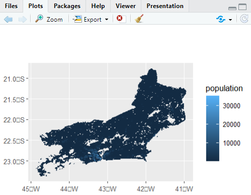{width="407"}

# Transformando nossos dados GeoPackage em Matriz

Nós vamos mapear os dados utilizando o pacote `rayshader` - um pacote para visualização 3D. O principal formato de dados que o `rayshader` trabalha é o formato matricial (`matrix`), portanto queremos que nossos dados estejam neste formato.

Para realizar essa conversão precisamos informar quantas colunas e linhas têm o nosso dataframe, ou seja, temos que informar o *aspect ratio* (a proporção) que a nossa matriz deve ter. Nós podemos informar isso com base nos valores da *bounding box* espacial dos nossos dados `estado_rio`.

## Obtendo valores da *bounding box*

Para **obter a os valores da *bounding box*** nós utilizamos a função `st_bbox()` em `estado_rio` e atribuímos o resultado à variável `bb`.

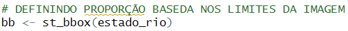{width="407"}

A função `st_bbox()` retorna os valores `xmin`, `ymin`, `xmax` e `ymax`, ou seja, os 4 "cantos da caixa" do gráfico.

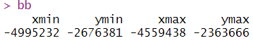{width="311"}

## Convertendo os valores de `bb` para *point coordinates*

Nós podemos usar esses valores, armazenados em `bb`, para calcular o *ratio* entre a largura e a altura dessa área, portanto temos que descobrir qual a altura e a largura da imagem. Para isso, primeiro precisamos **converter os valores de `bb` para *point coordinates*** com a função `st_point()`, onde informamos um vetor com os valores de uma das laterais de `bb` (ex.: `st_point(c(bb[['xmin']], bb[['ymin']]))`) e, numa sequência pipe, utilizamos a função `st_sfc()` para transformar as *point coordinates* em objeto espacial.

Além disso, dentro de `st_sfc()` informamos também o sistema de coordenadas, assim: `st_sfc(crs = st_crs(data)`. Fazemos o mesmo processo com o ponto de outra lateral para poder **calcular a distância** de um ponto de um canto ao outro ponto de outro canto.

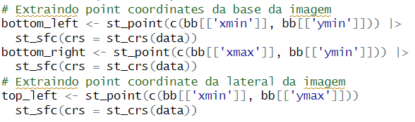{width="521"}

## Calculando a distância entre os pontos para obter a largura e a altura

Uma vez coletados os pontos de cada canto, podemos **calcular a distância** entre eles utilizando a função `st_distance()`. Nela passamos os valores dos dois pontos calculados e armazenados nas variávels (por ex.: `st_distance(bottom_left, bottom_right)` para calcular a largura da imagem). Fazemos o mesmo processo para obter os valores de altura.

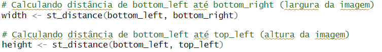{width="667"}

## Calculando *aspect ratio* ou a proporção da imagem

Agora que temos a altura e a largura da imagem, podemos **calcular o *aspect ratio*** (ou a proporção) da imagem. Para isso, se **largura \> altura**, podemos atribuir o valor de 1 para a largura e para proporção da altura (com relação a largura) dividimos altura / largura. Se **altura \> largura**, fazemos o mesmo processo porém inverso e divimos largura/altura. Se **altura == largura**, o *aspect ratio* será 1 x 1. Poderíamos fazer isso manualmente, mas optamos por criar uma função que já lida com as três possibilidades.

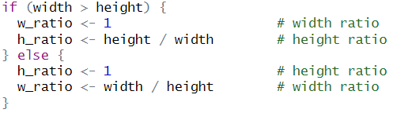{width="415"}

## Convertendo dados GeoPackage para raster para converter para matriz

Uma vez obtidos os valores referentes ao *aspect ratio* da imagem, podemos **definir a nossa matriz**. Nossos dados estão no formato espacial GeoPackage, para convertê-lo em matriz precisamos primeiro convertê-lo para o formato **raster** para em seguida converter para matriz. Para rasterizar nossos dados vamos utilizar a função `st_rasterize()` do pacote `stars`.

Além dos valores de *aspect ratio*, nós precisamos também definir o **tamanho** que nós queremos que nossa imagem tenha, para que possamos multiplicar esse valor pelo *aspect ratio* para que ela mantenha as devidas proporções. Para isso, criamos uma variável `size` e atribuímos a ela inicialmente o valor de `1000`. Feito isso, chamamos nossa função `st_rasterize()` e especificamos:

1.  Dados que queremos rasterizar (`estado_rio`);

2.  Número de células no eixo x, ou seja, o tamanho com a devida proporção do eixo x (`nx = floor(size * w_ratio)`);

3.  O tamanho com a devida proporção do eixo y (`ny = floor(size * h_ratio)`).

    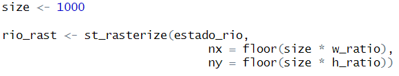{width="461"}

Realizada a conversão de .gpkg para raster (a qual armazenamos na variável `rio_rast`), podemos realizar a conversão do raster para matriz. Para isso utilizamos a função base do R `matrix()` e informamos basicamente os mesmos argumentos que na primeira conversão, com a diferença que dessa vez específicamos nossa coluna de interesse (`rio_rast$population`) e utilizamos os argumentos próprios da função para informar o número de células no eixo x (`nrow = floor(size * w_ratio)`) e no eixo y (`ncol = floor(size * h_ratio)`).

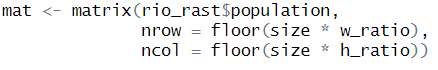{width="355"}

**NOTA:** A função `floor()` é utilizada para informar que queremos os números inteiros.

**DICA:**

-   Agora podemos excluir todas as variáveis com exceção de `mat`, `rio_rast`, `size`, `estado_rio`. Isso ajuda a liberar a memória do R para o processamento das próximas etapas de plotagem.

# Botando pra plotar!

Nessa etapa vamos utilizar os pacotes `rayshader` - para gerar o mapa 3d, `rgl` - possui função para fechar a janela interativa do mapa, `MetBrewer` - para selecionar nossa paleta de cores, e `colorspace` - nos permite gerar *swatches* das paletas de cores.

**Nota 1:** Os pacotes `rayshader` e `MetBrewer` devem ser instalados remotamente pelo GitHub.

**Nota 2:** As etapas a seguir não precisam ser feitas exatamente na mesma ordem, algumas podem necessitar de um "vai, vem" e testes consecutivos para pequenas correções, ajustes e acertos de modo a deixar o mapa exatamente como queremos. Isso é normal.

## Criando uma paleta de cores

A biblioteca [MetBrewer](https://github.com/BlakeRMills/MetBrewer) possui uma série de paletas de cores pré-definidas que podem ser conferidas no GitHub. Após escolher a paleta de cores `Tiepolo`, utilizamos a função `met.brewer()` para selecioná-la e atribuímos ela à uma variável, neste caso `c1`. Em seguida, utilizamos a função `swatchplot()` do pacote `colorspace` para exibir a paleta de cores de `c1`. Utilizamos o argumento `direction = -1` para inverter a ordem de cores da paleta.

Como estamos trabalhando com dados contínuos e não discretos, precisamos converter a paleta de cores em uma "rampa de cores", que corresponderá à "textura" do nosso mapa de elevação. Para isso, aproveitamos a função default do argumento `texture` de `height_shade()` para aplicar nossa própria paleta.

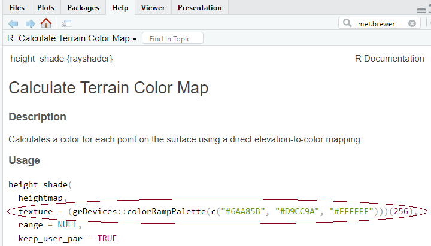{width="499"}

Portanto, criamos uma variável a qual chamamos `texture` e atribuímos a ela a função `colorRampPalette(c1, bias=2)(256)`, onde informamos a paleta de cores `c1` e uma tendência (*bias*) positiva (aumenta a predominância das cores do lado direito da paleta).

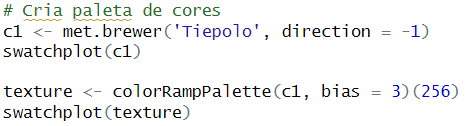{width="472"}

## Plotando

Uma vez concluídas as definições de cor, podemos iniciar a configuração de plotagem 3D do nosso mapa!

**Dica:** uma forma prática de fechar a janela do mapa é utilizando a função `close3d()` do pacote `rgl`.

### Criando modelo 3D

No `rayshader`, primeiro criamos criar o modelo 3D e, depois, mandamos renderizar em alta qualidade. Para criar o objeto 3D, primeiro aplicamos em `mat` a função `height_shade()` para informar a classificação de cores pela altura (nesse caso, representada pela concentração populacional) por meio do argumento `texture =` ao qual fornecemos a variável que criamos `texture`.

Na sequência pipe `%>%` utilizamos a função `plot_3d()`. Esta função pede o argumento `hillshade`, mas nesse caso ele foi substituído pela função anterior `height_shade()` em que passamos a textura. A função também pede o argumento `heightmap`, ou seja, a nossa matriz `mat`. Em seguida informamos a escala vertical por meio do argumento `zscale` (quanto maior o valor, menor será o exagero vertical e vice-versa) que, neste caso, definimos para `200` e dividimos por `2` **¹**. Em seguida utilizamos o argumento `solid = False` para informar que não queremos uma base sólida sob a área dos dados gerados**²**. Utilizamos também o argumento `shadowdepth` para informar a partir de onde queremos que a sombra seja projetada; `shadowdepth` utiliza como referência os próprios dados da matriz de referência, nesse caso o menor valor que temos na nossa matriz é 1 (pessoa).

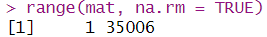{width="235" height="33"}

Como queremos a sombra bem "grudada" na base dos dados, definimos `shadowdepth = 0`. Em seguida, definimos as configurações de posicionamento da câmera por meio dos argumentos: `theta` (ângulo de rotação), `phi` (ângulo azimutal) e `zoom` (aproximação). Definimos `theta = 0`, partindo da compreensão de que o ângulo zero (0), não rotacionado, desses mapas é o norte. Definimos `phi = 33` uma vez que 90° por exemplo seria como se estivéssemos olhando diretamente de cima e 0° como se estivéssemos olhando de frente no nível do chão. Por fim definimos `zoom = .8`, sendo o default `1`.

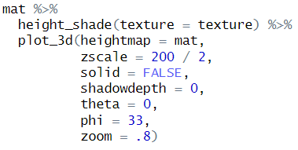{width="334"}

**¹** O argumento `size` da etapa de conversão dos nossos dados para raster influencia na interpretação do argumento `zscale`. Inicialmente havíamos definido o `zscale=200`, porém para o render final nós aumentos o tamanho do nosso raster com `size = 2000`, portanto, para manter a proporção do `zscale` nós dividimos `200 / 2`.

**²** O argumento `solid =` da função `plot_3d()` é, por default, `TRUE`. No meu caso, se eu não configurar para `FALSE` a renderização falha e a sessão do R é abortada. Caso ocorra algo parecido e o argumento não esteja definido para `FALSE`, verificar se não é este o motivo.

**Nota:** Na documentação do pacote `rayshader` é recomendado utilizar o pipe do pacote `magrittr` , o `%>%`.

**Nota:** No tutorial original as configurações de posicionamento da câmera são definidas na função `render_camera()` ao invés de dentro da função `plot_3d()`, entretanto, no meu caso, utilizar essa função resultou em problemas de renderização com a função `render_highquality()` na etapa a seguir.

### Renderizando em alta qualidade

**Dica:** Nesta etapa recomenda-se criar uma pasta no diretório do projeto para armazenar plots de teste e o plot final.

**Nota:** Quando fazendo os primeiros testes com a função `render_highquality()` podemos utilizar o argumento `filename` para já armazenar os testes no diretório **ou** podemos não especificar o argumento e o render poderá ser visualizado na aba "Plots". Alternativamente também o render pode ser salvo posteriormente, por fora da função.

Para renderizar em alta qualidade chamamos na função `render_highquality()` primeiramente os argumentos `width` (largura) e `height` (altura) para definir as **dimensões da nossa imagem**. Inicialmente é recomendado começar com valores menores (como `270`, `540`, `810`...) e ir subindo conforme a velocidade de processamento do seu dispositivo e, apenas quando todas as demais configurações estiverem certas, renderizar no tamanho máximo desejado.

Outro argumento em `render_quality()` que podemos definir para influenciar na **resolução da imagem** é `samples` ou o número de "amostras". O valor default de `samples` é `100`, quanto maior o número de amostras maior será o tempo de renderização e melhor será a qualidade. Neste caso definimos `samples = 360`.

Para **desabilitar a janela interativa** utilizamos o argumento `interactive = FALSE`.

Podemos também configurar as opções de iluminação da cena, como a direção, altitude, cor e intensidade da(s) luz(es). Para configurar a **direção da luz** utilizamos o argumento `lightdirection` e, entendendo o norte da imagem como o ângulo 0°, indicamos a angulação a partir da qual as luzes serão emitidas, neste caso definimos `lightdirection = c(225,135)`.

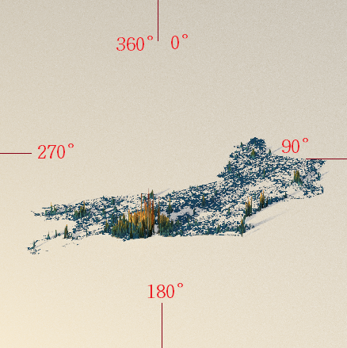{width="379"}

Para configurar a **altitude da iluminação** (sendo 90° olhando de cima para baixo em um ângulo reto e 0° olhando de frente no nível da base) utilizamos o argumento `lightaltitude`. Podemos configurar mais de uma luz no render, neste caso definimos uma luz mais baixa (20°) e outra mais alta (80°): `lightaltitude = c(20, 80)`. Para definir a **cor das luzes** utilizamos o argumento `lightcolor`, neste caso colorimos a luz mais baixa com a quinta cor do swatchplot de `c1` e a colorimos a mais alta de branco: `lightcolor = c(c1[5], 'white')`.

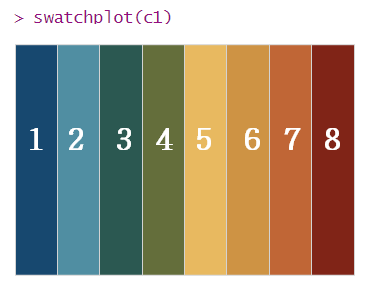

Para configurar a **intensidade da luz** utilizamos o argumento `lightintensity`, cujo valor default é `500`. Nesse caso configuramos a luz de cor `c1[2]` para `600` (mais intensa) e a luz branca para `100` mais fraca: `lightintensity = c(600, 100)`. Muitas dessas configurações são com base em tentativa e erro, você vai testando até ver quais configurações mais te agradam com os dados que estiverem sendo trabalhados.

Para aumentar a **resolução da imagem** basta voltar na variável `size` que criamos na etapa **Convertendo dados GeoPackage para raster para converter para matriz** e modificar o valor que atribuímos para size e rodar novamente os códigos seguintes para aumentar o tamanho da matriz `mat`. No tutorial original, a resolução final de `size` é aumentada para `5000`, porém é recomendado ir testando com valores menores e ir aumentando gradualmente. Ao aumentar a imagem isso irá influenciar em algumas configurações anteriores como o exagero vertical do argumento `zscale` da função `plot_3d()`, como o `zscale` foi definido como `100` e previamente o nosso `size` era igual a `1000`, para resolver isso basta definir `zscale = 100 / 5` caso mudemos o `size` para `5000`, ou seja, basta mantermos as proporções.

**Observação:**

-   As configurações de `size` da matriz `mat` influenciam no intervalo dos valores, de forma que quanto maior o `size` menor o intervalo e, portanto, mais detalhada é a matriz. Veja o exemplo abaixo com histogramas com *bins* diferentes:

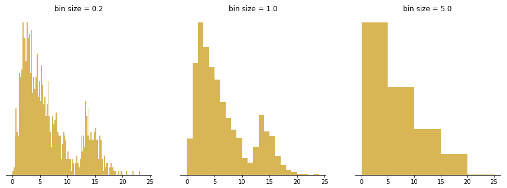{width="658"}

-   Já os argumentos de `width` e `height` da função `render_highquality()` funcionam de forma semelhante, porém eles vão informar o tamanho dos pixels da imagem a ser renderizada e não da matriz em si, como no caso do `size`.

### Monitorando duração do render de alta qualidade

Renderizar em alta qualidade pode ser um processo bem demorado dependendo das configurações de resolução definidas, por isso é interessante poder verificar o tempo decorrido no processo. Para isso deixamos a função `render_highquality()` entre chaves `{}` e utilizamos a função `Sys.time()` antes (`start_time`) e após (`end_time`) a função `render_highquality()` para registrar a hora de início do bloco de código e a hora em que termina o processamento do bloco de código. Por fim, também calculamos a diferença do horário de início com o do fim, para descobrir a duração total do processamento.

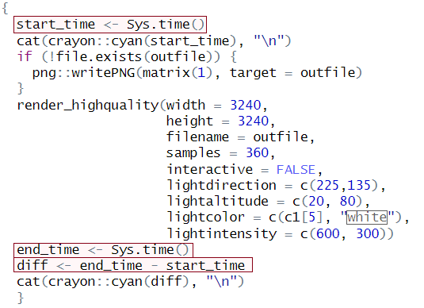{width="410"}

Também utilizamos a função `cat()` para printar de forma concatenada os valores registrados por `Sys.time()` e uma string `"\n"` para dar "Enter" na linha após o valor de `Sys.time()`. Utilizamos a função `cyan()` do pacote `crayon` apenas para que a informação retornada no console seja da cor "Ciano".

Outra coisa que podemos fazer para auxiliar no monitoramento do render é criar uma função para, caso o arquivo não exista, ou seja, não seja gerado, criar uma matriz de 1x1. Assim, se no caminho o render não aparecer mas tiver uma matriz 1x1, saberemos que o problema não foi com o caminho, mas sim na renderização em si. Para isso escrevemos a seguinte função destacada na caixa com bordas vermelhas:

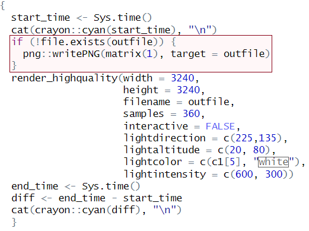{width="382"}

**Nosso render final ficou assim:**

# Fim! Ou quase...

Uma vez feliz com todas as configurações e com sua imagem devidamente renderizada e salva no seu diretório, nós podemos **acrescentar algumas informações** a ela se desejarmos. Neste caso, estamos trabalhando com um mapa de densidade populacional do estado do Rio de Janeiro no Brasil, porém essa informação não é óbvia para alguém que não tenha confeccionado o mapa e trabalhado com os dados pessoalmente. Portanto, vamos acrescentar essas informações e também a fonte dos dados utilizados.

Uma vez que essa etapa exige apenas a imagem `.png` salva, nós podemos criar um novo script para ela.

Para esta etapa vamos utilizar a biblioteca `magick` para adicionar os textos na imagem, vamos também importar as bibliotecas utilizadas anteriormente `MetBrewer` e `colorspace` para realizar alterações de cor nos textos, a biblioteca `ggplot2` para editar transparência dos elementos da imagem, e a biblioteca `glue` para redação de múltiplos textos em simultâneo e a biblioteca `stringr` para realizar modificações de encaixe dos textos.

Primeiro **importamos a nossa imagem** para o `environment` com a função `image_read()` da biblioteca `magick`.

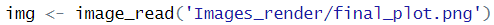{width="408" height="21"}

Nesse caso, vamos querer que a cor do nosso texto esteja na mesma **paleta de cores** no nosso mapa, por isso vamos importar a paleta `Tiepolo` da `MetBrewer` da mesma forma que fizemos anteriormente. Em seguida, para obtermos tonalidades ainda mais escuras da paleta utilizamos a função `darken()` da `colorspace` na cor `7` da paleta, e escurecemos `.25` (o valor default é `.1`). E utilizamos a função `swatchplot()` para plotar as cores da paleta Tiepolo quanto da versão escurecida.

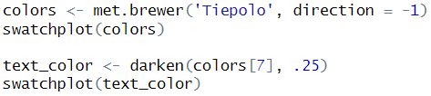{width="394"}

Em seguida utilizamos a função `glue()` para já escrever um **texto mais extenso** que vamos inserir na imagem depois com `image_annotate()` da `magick`. Atribuímos o texto à variável `annot` e utilizamos numa sequência pipe a função `str_wrap()` da `stringr` para definir a largura do texto.

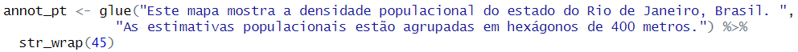

## Cortando a imagem

Antes de começar a inserir os textos na imagem, decidimos **cortar a imagem** para reduzir o espaço em branco na área superior e inferior ao mapa. Para isso aplicamos em `img` a função `image_crop()`, nela utilizamos o argumento `gravity` para definir a **localização inicial** da imagem para as alterações, as opções de definição de `gravity` são: `north`, `northwest`, `northeast`, `south`, `southeast`, `southwest`, `center`. Neste caso definimos `gravity = "center"`. Também utilizamos o argumento `geometry` para definir a **geometria de corte** da nossa imagem; levando em conta que seu formato original é de 3240x3240 pixels e que queremos cortar apenas a altura e não a largura, definimos `geometry = "3240x1890"`. Em seguida, dentro da mesma `string` passamos a localização em que queremos cortar, para isso passamos `+0` pois não queremos modificar nada no eixo x e passamos `-50` para mover o ponto de corte para 50 pixels mais para baixo, assim: `geometry = "3240x1890+0-50"`.

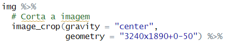{width="384"}

## Image_annotate() e seus argumentos

**Observação:** o código completo desta etapa + a anterior se encontra no final da página.

Para **inserir os textos na imagem** utilizamos a função `image_annotate()` e no primeiro argumento informamos o texto que queremos inserir, isso pode ser feito tanto diretamente no formato de `string` ou podemos inserir por exemplo nossa variável `annot` que criamos anteriormente. Em seguida informamos a "gravidade" `gravity`, a localização inicial da localização do nosso texto, para o título informamos `gravity = "northwest"`.

Informamos também a **localização** `location` do texto, utilizamos esse argumento para posicionar o texto na imagem a partir do ponto inicial (definido em `gravity`) de modo que informamos em uma `string` a quantidade de pixels que queremos mover o texto no eixo x e y, como num plano cartesiano; a localização do título ficou definida como `location = "+150+200"`.

[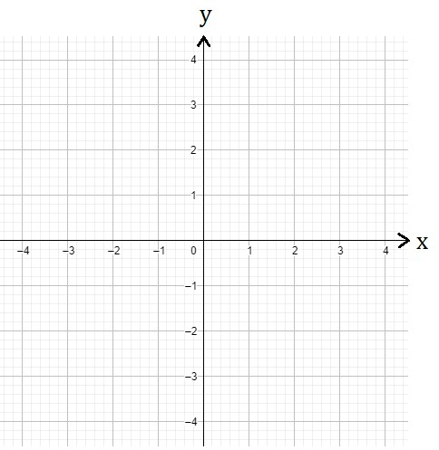{width="372"}](https://www.infoescola.com/matematica/plano-cartesiano/)

Ainda em `image_annotate()`, para aplicar a **cor** que definimos previamente como `text_color` no texto, chamamos o argumento `color = text_color`. Se quisermos editar a **transparência** do texto, podemos utilizar a função `alpha()` da biblioteca `ggplot2`, por exemplo: `color = alpha(text_color, .5)`. Para editar o **tamanho** do texto, utilizamos o argumento `size` para definirmos o tamanho em pixels; para o título configuramos `size = 100`.

Para definir a **fonte** do texto utilizamos o argumento `font` e informamos uma `string` com a família da fonte, como por exemplo "Times", "serif", "Helvetica", etc. Neste caso nós definimos `font = "Palatino"`. Para verificar as fontes disponíveis no Windows basta acessar "**Configurações de fonte**" na barra de busca do sistema. Para baixar mais fontes é possível acessar o site de [fontes do google](https://fonts.google.com/) e fazer a instalação. Para aplicar o efeito **negrito** na fonte, utilizamos o argumento `weight` igual a `700` (o default, normal, é `400`).

Para **anotar mais textos na mesma imagem** basta acrescentar na sequência pipe `%>%` outra função de `image_annotate()` com o texto e os demais argumentos desejados.

Por fim, como é mais rápido trabalhar com a imagem final do que esperar ela ser gerada no `Viewer`, utilizamos no final da sequência pipe `%>%` a função `image_write()` para **salvar a imagem** no local definido e passamos com um nome diferente do arquivo para não sobrescrever a imagem original, neste caso, `titled_final_plot.png`. Para visualizar a imagem basta acessar o diretório e abri-la.

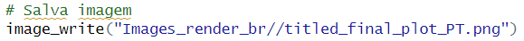{width="467"}

Nosso **código final** com o corte da imagem e anotações de título, descrição e fonte ficou assim:

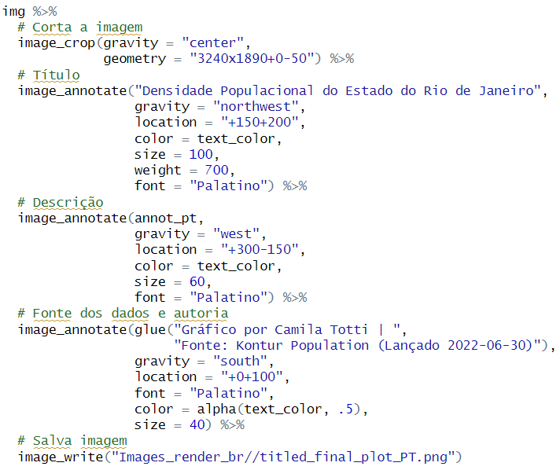{width="587"}

**Agora sim, fim!**

