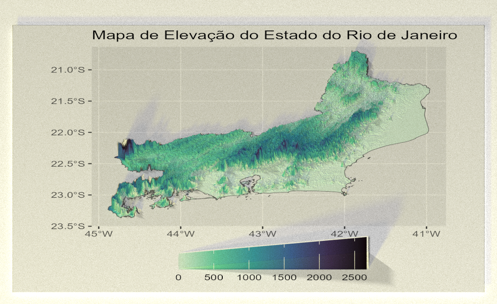
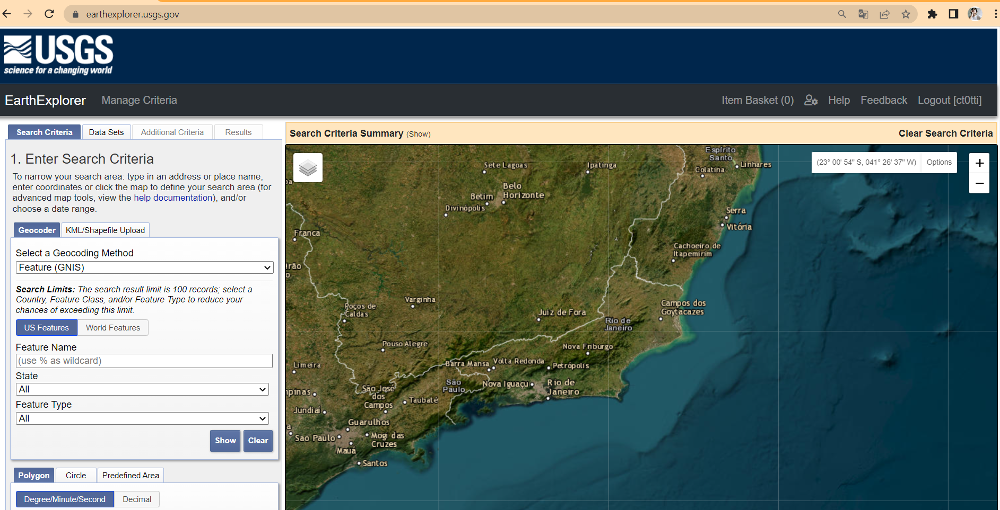
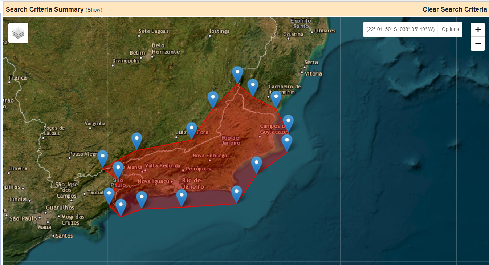
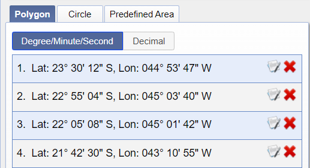
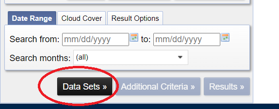
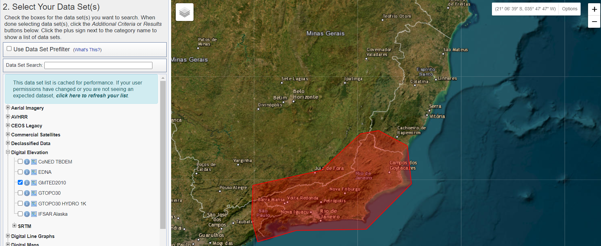
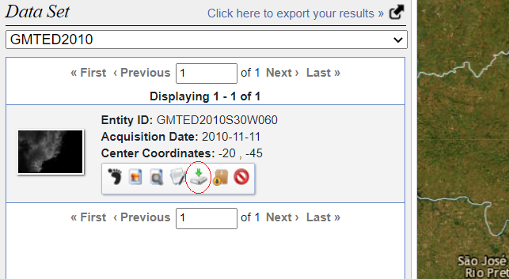
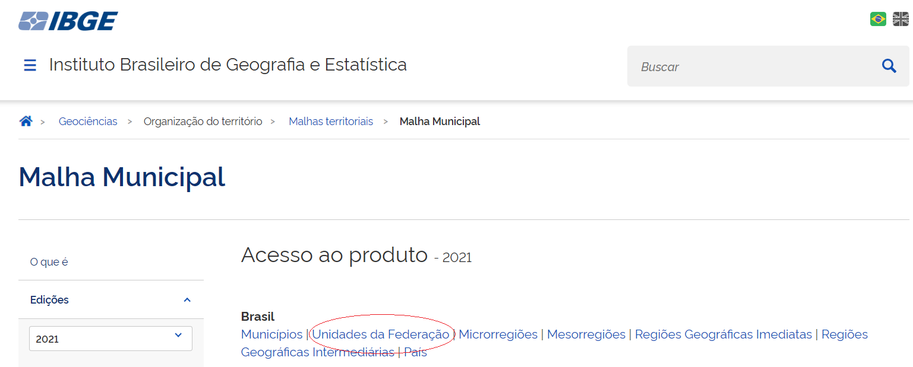

## Mapa 3D de Elevação do Rio de Janeiro com Rayshader e ggplot2

Este repositório contém os scripts utilizados para a confecção de um mapa de elevação com a biblioteca rayshader e outro mapa em que utilizamos a biblioteca `ggplot2` em associação com `rayshader`.

A principal diferença entre ambos os mapas é que o mapa confeccionado com `ggplot2` em associação com `rayshader` possui legenda de cor e as coordenadas x e y incluídas na visualização. Apresentando um caráter mais técnico, enquanto o mapa sem `ggplot` é de caráter artístico.

## Sobre o pacote Rayshader

Rayshader é um pacote de código aberto voltado para a produção visual 2D e 3D de dados no R desenvolvido por [Tyler Morganwall](https://github.com/tylermorganwall). O pacote utiliza dados de elevação em uma matriz base R e uma combinação de *raytracing*, algoritmos de sombreamento e sobreposições para gerar mapas. Para saber mais sobre o pacote é possível acessar seu [site oficial](https://www.rayshader.com/).

## Reprodução

Os arquivos raster foram obtidos manualmente a partir do site [Earth Explorer - USGS](https://earthexplorer.usgs.gov/) e os arquivos shapefile foram obtidos manualmente no site do [IBGE](https://www.ibge.gov.br/geociencias/organizacao-do-territorio/malhas-territoriais/15774-malhas.html). Após o download, eles foram extraídos e armazenados em uma pasta intitulada "dados" no diretório do projeto.

Os scripts `Rayshader_RJ_Relevo.R` e `Anotacoes_RJ_Relevo.R` correspondem a duas etapas de confecção do mapa de relevo do RJ sem a biblioteca `ggplot2`. Para verificar o script utilizado para confecção do mapa com `ggplot2` acesse a pasta `Rayggplot_RJ`.

## Download dos arquivos raster

No site do [Earth Explorer - USGS](https://earthexplorer.usgs.gov/), primeiro nós vamos localizar o estado do Rio de Janeiro no mapa.

Para navegar no mapa é possível clicar e arrastar a tela e dar *zoom in* e *zoom out* com o *scroll* do mouse ou fazer movimento de pinça no *touchpad* do notebook.

Uma vez identificado o Rio de Janeiro no mapa, nós vamos delimitar a área do estado. Para isso, basta clicar na tela ao redor do limite do estado (sem arrastar a tela), isso gerará marcadores de pontos que, somados, irão compor nossa área.

Na parte inferior do canto esquerdo da tela em **Polygon** é possível observar a lista de pontos criados e, caso necessário, apagar pontos clicando no "X" vermelho.

{width="417"}

Concluída essa etapa, podemos clicar em "**Data Sets \>**" localizado também no canto inferior esquerdo da tela, abaixo de "**Polygon**".

{width="402"}

Em **Data Sets**, nós podemos selecionar as imagens de satélite que queremos obter do site da USGS. Neste caso, queremos os dados de elevação, portanto vamos selecionar a opção **Digital Elevation** e neste caso utilizamos as imagens do satélite **GMTED10**.

Em seguida, no canto inferior esquerdo da tela podemos clicar em "**Results \>**" para ver as imagens disponíveis do GMTED10 para a área selecionada do Rio de Janeiro.

No canto esquerdo da tela vamos ter uma lista das imagens disponíveis na área selecionada. para fazer o download da imagem, basta clicar no ícone destacado na imagem abaixo e indicar a resolução da imagem (neste caso, 7.5 arc sec).

Uma vez concluído o download basta salvar o arquivo numa pasta no diretório do seu projeto e extraí-lo.

## Download dos arquivos shapefile

Para realizar o download dos arquivos shapefile basta acessar o site do [IBGE](https://www.ibge.gov.br/geociencias/organizacao-do-territorio/malhas-territoriais/15774-malhas.html) e clicar em **Unidades da Federação** embaixo de **Brasil**.

Em seguida, salve o arquivo em uma pasta localizada no diretório do seu projeto e extraia-o.
